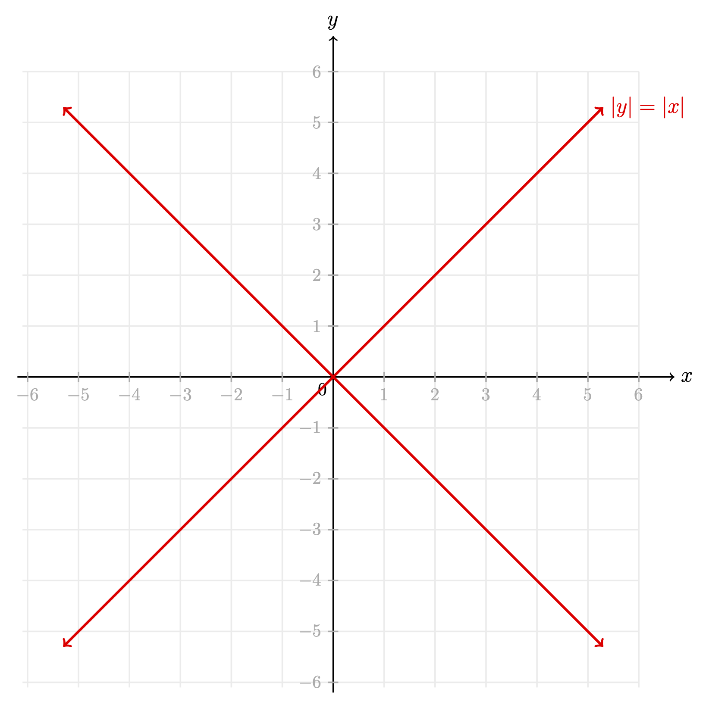

Problem statement:

A game piece begins at $(x,y)=(0,0)$ on an 2D Cartesian plane. The game piece is allowed six moves with each move being parallel to an axis. After the six moves, what is the probability that the game piece is located on $|y| = |x|$?  




```python
import numpy as np
import matplotlib.pyplot as plt
```


```python
iterations_array = np.logspace(1,
               7,
               num = 7,
               endpoint = True,
               base = 10.0)
iterations_array
```


    array([1.e+01, 1.e+02, 1.e+03, 1.e+04, 1.e+05, 1.e+06, 1.e+07])


```python
int(iterations_array[0])
```


    10


```python
#params
step_list = [[0, 1], [0,-1], [1, 0], [-1, 0]]
initial_coord = [0, 0]
seed = 1027
iterations = int(iterations_array[6])

# initial info
np.random.seed(seed=seed)
x,y = initial_coord
```


```python
n = 0
N=iterations
num_choices = len(step_list)
for iteration in range(iterations):
    for step_number in range(6):
        step_index = np.random.choice(num_choices)
        x_step,y_step = step_list[step_index]
        x += x_step
        y += y_step
    if np.abs(x) == np.abs(y):
        n += 1
prob_estimate = n / N
print(prob_estimate)
```

    0.0003321


(10, 0.3), (100, 0.11), (int(iterations_array[2]), 0.037), (int(iterations_array[3]), 0.0107), 

(int(iterations_array[4]), 0.00351)

(int(iterations_array[5]), 0.000601)

(int(iterations_array[5]), 0.0003321


```python
class Position:
    def __init__(self, initial_coord=[0,0]):
        self.x, self.y = initial_coord
    
    def step(self, step_list = [[0, 1], [0,-1], [1, 0], [-1, 0]]):
        step_index = np.random.choice(num_choices)
        x_step,y_step = step_list[step_index]
        self.x += x_step
        self.y += y_step
        
```
