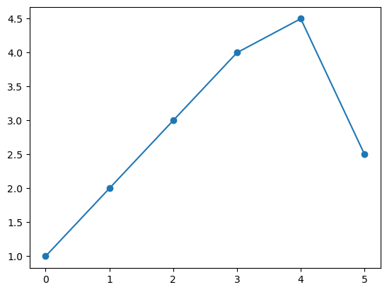
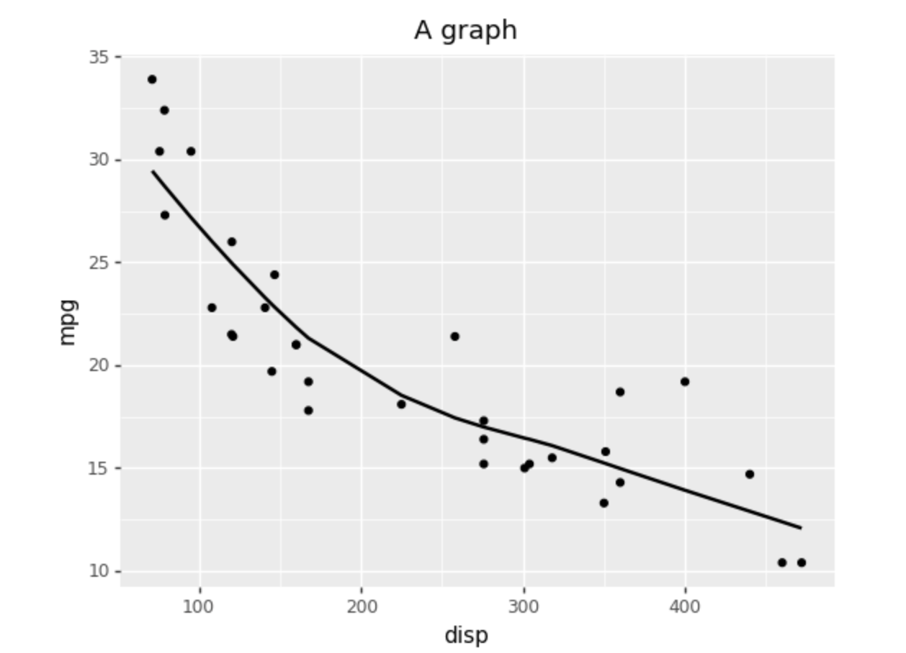

```python
import pandas as pd
import matplotlib.pyplot as plt
import numpy as np
```


```python
# Rendered as code and resulting print to console rendered
print('test')
```

    test


```python
# Construct basic dataframe and print out characteristics
df = pd.DataFrame({'a':[1, 2, 3, 4, 4.5, 2.5]})
df.info()
df.head()
```

    <class 'pandas.core.frame.DataFrame'>
    RangeIndex: 6 entries, 0 to 5
    Data columns (total 1 columns):
     #   Column  Non-Null Count  Dtype  
    ---  ------  --------------  -----  
     0   a       6 non-null      float64
    dtypes: float64(1)
    memory usage: 176.0 bytes


<div>
<style scoped>
    .dataframe tbody tr th:only-of-type {
        vertical-align: middle;
    }

    .dataframe tbody tr th {
        vertical-align: top;
    }

    .dataframe thead th {
        text-align: right;
    }
</style>
<table border="1" class="dataframe">
  <thead>
    <tr style="text-align: right;">
      <th></th>
      <th>a</th>
    </tr>
  </thead>
  <tbody>
    <tr>
      <th>0</th>
      <td>1.0</td>
    </tr>
    <tr>
      <th>1</th>
      <td>2.0</td>
    </tr>
    <tr>
      <th>2</th>
      <td>3.0</td>
    </tr>
    <tr>
      <th>3</th>
      <td>4.0</td>
    </tr>
    <tr>
      <th>4</th>
      <td>4.5</td>
    </tr>
  </tbody>
</table>
</div>


```python
# Make a test plot
plt.plot(df.index, df['a'], marker='o')
plt.show()
```


    

    


# Test header
This is some text in a markdown cell. The following equation for a line $y=mx+b$ should be in LaTeX font.

Add another markdown cell and include an image:


Note that after completing work on the present notebook (`index.ipynb`), 
convert the Jupyter notebook into a Markdown (`.md`) file using the following command:
```bash
jupyter nbconvert --to markdown index.ipynb
```    


